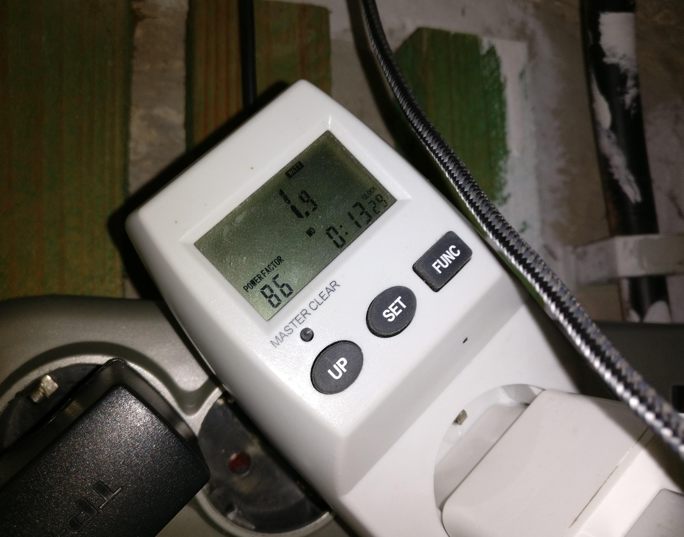

Projekt Auswertung
==================

Genauigkeit & Stabilität
------------------------

In den tests, wo hauptsächlich die Kabelenden mit Wasser in berührung kamen, funktionierten die tests zuverlässig und
innerhalb von 2 Sekunden wurden die Zustandsänderungen via Telegram gesendet. Es fehlte zum Schluss leider die Zeit für
ausführlichere Tests, so wäre es interessant zu sehen, wie sich die Kapazität im Kabel ändert, wenn das Kabel zu teilen
in Wasser wäre ohne das die Kabelenden Wasser direkt berühren oder wie sich die Kapazität in den Kabeln ändert wenn
der Keller eine sehr hohe Luftfeuchtigkeit hat.

Der :ref:`aufbau_1_raspberry_pi_gpio` war über einen Monat im Keller in Betrieb. In diesen ersten Aufbau war die
Netzwerk Anbindung noch über ein WLAN Stick, dieser hatte zwar eine relativ starke Sende- & Empfangsleistung aber die
Reaktionszeit des :term:`Raspberry Pi`'s war des öfteren durch WLAN abbrüche über einige Minuten. Außerdem wurde in den ersten
Aufbau auch nur alle 3 Minuten die Kabel auf Wasser überprüft, so dass fließendes Wasser nicht immer als solches gemessen
werden konnt. Trotz den Problemen mit den Aufbau, war der :term:`Raspberry Pi` die gesamte Zeit zuverlässig über den
Telegram Bot erreichbar.

Hingegen der :ref:`aufbau_2` überzeugte mit der schnellen Reaktionszeit auf kurzzeitige Änderungen. Auch der austausch
des WLAN Sticks zu einen WLAN Router als :term:`WLAN zu LAN Bridge` sorgte zu einer immer schnellen Reaktionszeit des
Telegram Bots. Der Aufbau steht seid einer Woche nun im Keller & arbeitet dabei Fehlerfrei. Auch die Arduinos arbeiten
im Dauerbetrieb bislang Fehlerfrei und senden innerhalb Sekunden Zustandsänderungen an den :term:`Raspberry Pi`.

Stromverbrauch
--------------

Der :term:`Raspberry Pi` verbraucht ohne angeschlossenden USB Geräte, Ethernet Anbindung und aktivieren KellerBot Dameon 1,5 Watt
pro Stunde und mit jeden neu angeschlossenden :term:`Arduino Nano` steigt der Verbrauch um 0,2 Watt die Stunde an.
So ergab es bei meinen Aufbau mit 2 angeschlossenden :term:`Arduino Nanos` ein gesamt Verbrauch von 1,9 Watt pro Stunde,
Stromverbauch ist auf :numref:`stromverbauch` zu sehen. Bei durchschnittlichen 720 Stunden im Monat ergibt sich ein
Monatsverbauch von 1,368 Kilowatt.

.. _stromverbauch:

    Stromverbauch des aufbaus mit 2 Arduinos, Anzeige Watt pro Stunde

Fazit
-----

Das angestrepte Ziel wurde kosteneffektive gelöst, wobei nur 3 :term:`Arduino Nanos` für ca 13€ nachgekauft werden mussten und
die restliche Hardware & Kabel aus alten Projekten stammte und nicht mehr verwendet wurden. Auch können nun alle
Bewohner des Hauses zeitnah auf ein Wasserschaden in Keller hingewiesen werden, wobei größeren Schaden somit frühzeitig
vermieden werden können.

Telegram überraschte mich bei der Arbeit äußert positiv, ein eigenen Bot mittels Telegram zu erstellen stellte sich
als sehr einfach da. Auch ist es stark von vorteil das keine extra Software auf ein Smartphone installiert werden muss
um den KellerBot zu verwenden und durch die leichte Bedienung ist Telegram auch ein praktisches Tool für Computer Leihen,
die sich nicht erst an einer neuen Software gewöhnen müssen, sondern im erstfall zuverlässig eine Nachricht auf ihr
Smartphone erhalten.