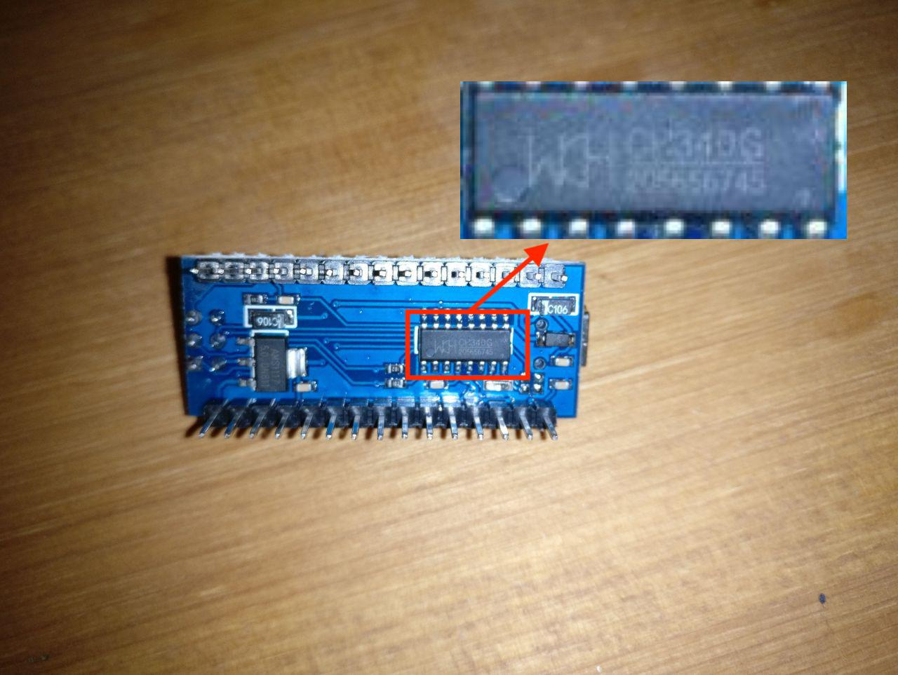

========
Hardware
========

Für dieses Projekt wurde ein `Raspberry Pi Model B+ V1.2`, 3 `Arduino Nano`, ein `DHT22 temperature-humidity sensor´
und 3 `zwei ardriges nicht abgeschirmtes Kupferkabel` verwendet.

Arduino Nano
------------

Für dieses Projekt wurden nicht Orginale `Arduino Nanos` verwendet, dadurch müssen die entsprechenden Treiber noch
nach installiert werden. Die Treiber sollten aber nur dann nachinstalliert werden, wenn diese nicht schon vom Werk aus
auf dem System vorhanden sind, wie z.B. MacOs.

Auf der Rückseite des Nanos (:numref:`Arduino_Nano_Controller`) steht der Controller Name.

.. _Arduino_Nano_Controller:

    Arduino Nano Controller Name

In diesen Fall ist der Treiber auf https://sparks.gogo.co.nz/ch340.html zu finden.