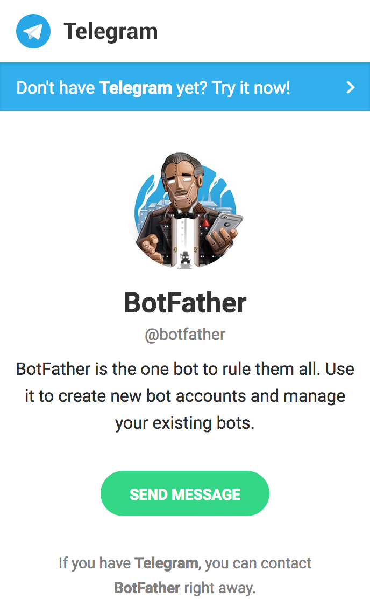
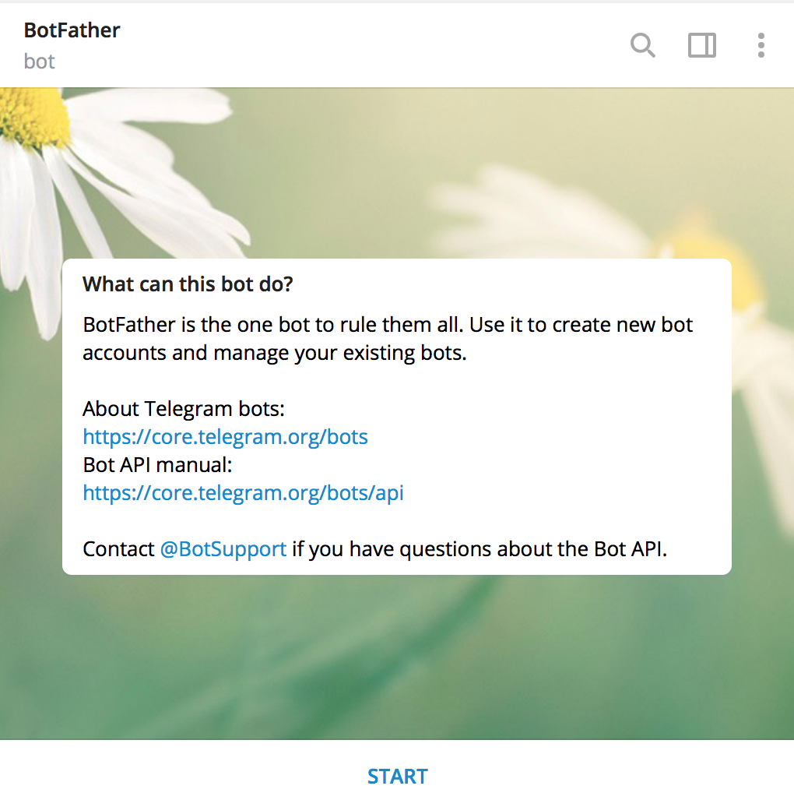
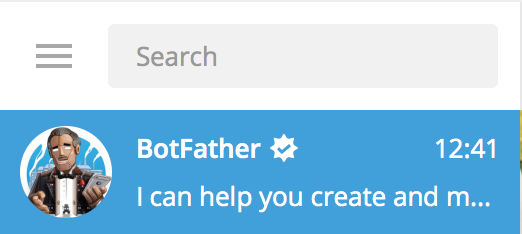
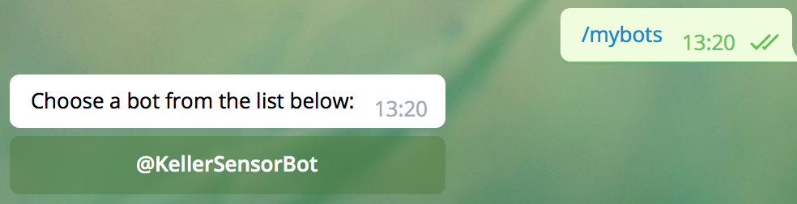
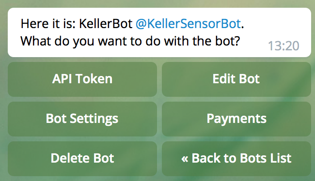
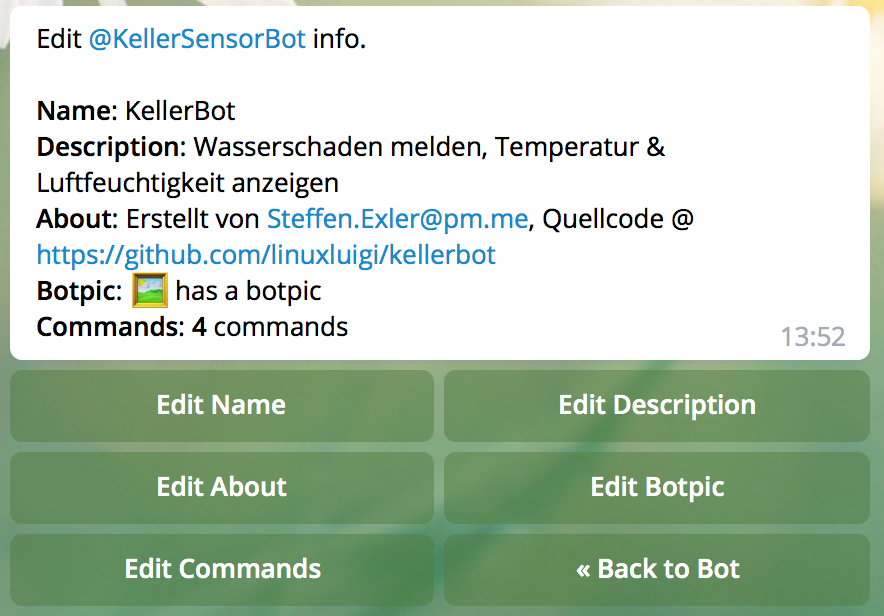
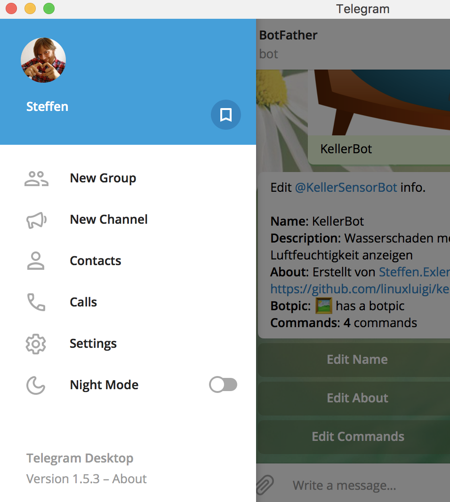
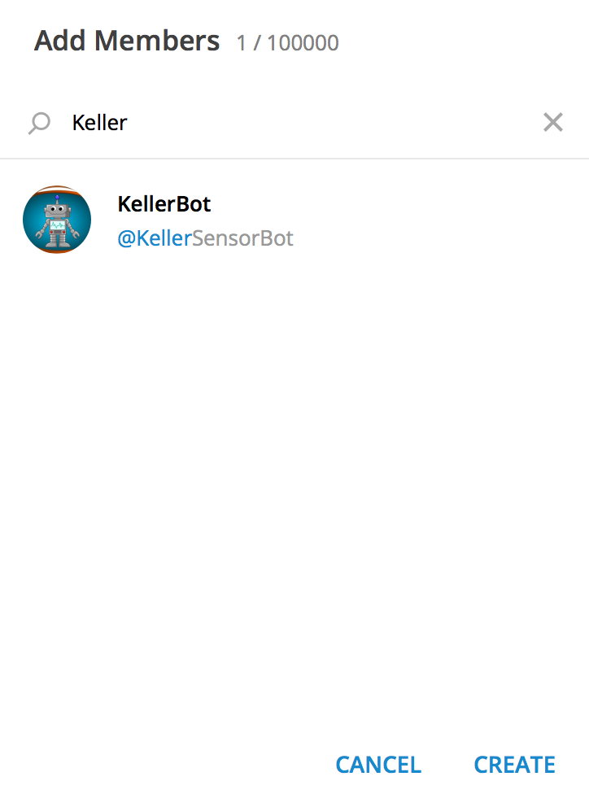
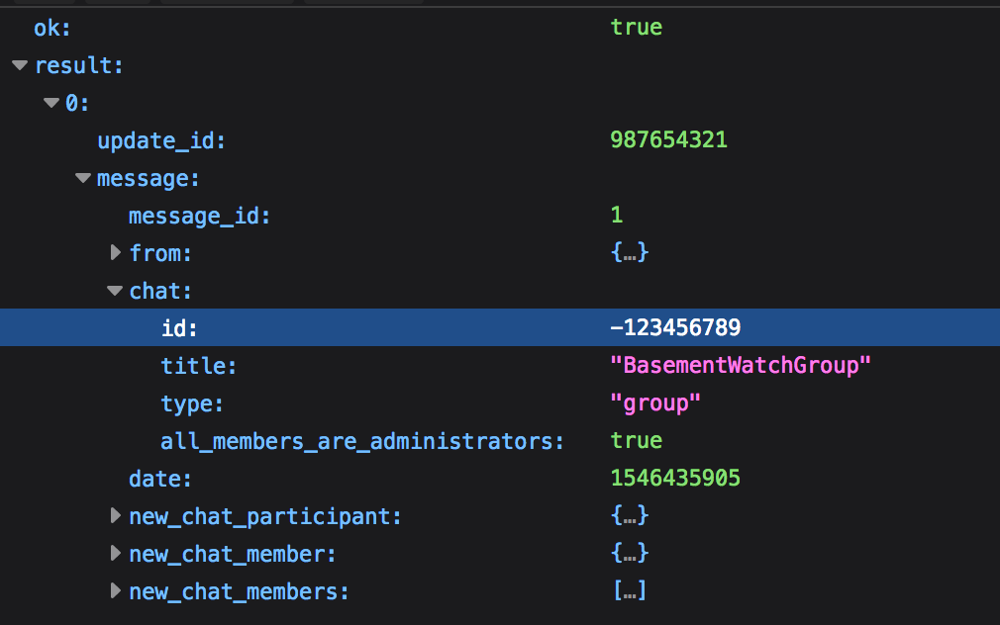

.. _Telegram:

Telegram
========

Über
----

Telegram ist ein dezentraler cloudbasierter Instant-Messenger, welcher ein offenes Protokoll und OpenSource Clients,
verwendet. Außerdem ist es möglich eigene :ref:`Telegram_Bot` zu programmieren, mit den die User interagieren können.

Offizielle Website: `Telegram.org`_

.. _Telegram.org: https://telegram.org/
.. _Telegram_Bot:

Telegram Bot
------------

Ein Telegram Bot ist ein Programm, welches auf jeder Plattform laufen kann und sich wie ein User im Chat mit extra
Funktionen verhält. So ist es möglich, den Bot via Befehlen, die mit ``/`` starten zu steuern, wie zum Beispiel
``/hilfe`` welches die für diesen Bot möglichen Befehle anzeigt. Im FAQ_ auf der Offiziellen Telegram Seite
wird der Telgram Bot genauer erklärt.

Für die Integration in diesen Projekt wurde der Python Telegram Wrapper python-telegram-bot_ verwendet, dieser
erlaubt es mit wenigen Zeilen Code einen nützlichen Telegram Bot zu erstellen.

.. _FAQ: https://telegram.org/faq#bots
.. _python-telegram-bot: https://python-telegram-bot.org/

Telegram Bot erstellen
----------------------

Info
    Diese Anleitung ist speziell für das Projekt ``KellerBot`` erstellt. Alle möglichen Funktionen des Telegram
    Bots sind auf `Telegram Bot Entwickler Dokumentation`_ nachzulesen.

.. _Telegram Bot Entwickler Dokumentation: https://core.telegram.org/bots

1. BotFather einrichten
^^^^^^^^^^^^^^^^^^^^^^^

Der Telegram ``BotFather`` ist ein Telegam Bot, welcher zur Verwaltung der eigenen Telegram Bots dient. Mit diesem
Bot ist es möglich, einen eigenen Bot zu erstellen, Befehle einzurichten, das Profilbild des Bots anzupassen und mehr.

Um Zugriff auf den ``BotFather`` zu erhalten, muss auf der Seite `telegram.me/botfather`_ auf ``SEND MESSAGE`` geklickt
werden (:numref:`BotFather_hinzufügen`).

.. _telegram.me/botfather: https://telegram.me/botfather

.. _BotFather_hinzufügen:

    BotFather hinzufügen

Anschließend öffnet sich das Telegram Fenster mit dem ``BotFather`` (:numref:`BotFather_init_chat`). In diesem Fenster
auf ``START`` klicken um dem ``BotFather`` zu interagieren.

.. _BotFather_init_chat:

    BotFather Chat starten

Nachdem der Chat mit dem ``BotFather`` erstellt wurde, wird dieser im Kontaktverlauf angezeigt und kann so
wieder direkt verwendet werden (:numref:`BotFather_history_contact`).

.. _BotFather_history_contact:

    BotFather Kontakt Verlauf

.. _Telegram_create_bot:

2. Eigenen Bot erstellen
^^^^^^^^^^^^^^^^^^^^^^^^

Um einen neuen Bot zu erstellen, muss im Chat des ``BotFather`` (:numref:`BotFather_history_contact`) der Befehl
``/newbot`` eingeben werden. Danach muss im Chat der Namen des neuen Bots geschrieben werden, in diesen Beispiel wird
er ``KellerBot`` heißen.

.. hint::
    Der Bot Name muss immer mit ``bot`` enden und muss einzigartig sein, also der Name darf noch nicht vergeben sein!
    Beispiele ``Keller_bot``, ``KellerBot``, ``kellerbot`` oder ``kellerBOT``.

Nachdem Erstellen des Bots gibt Telegram die URL & den :term:`Token` des Bots aus:

    Done! Congratulations on your new bot. You will find it at `t.me/KellerBot`_. You can now add a description, about section and profile picture for your bot, see /help for a list of commands. By the way, when you've finished creating your cool bot, ping our Bot Support if you want a better username for it. Just make sure the bot is fully operational before you do this.

    Use this token to access the HTTP API:
    659931436:AAEAVoiIJxkswS-nl3tLBaTC1ydsgJn5SVA

    For a description of the Bot API, see this page: https://core.telegram.org/bots/api

.. _t.me/KellerBot: https://t.me/KellerBot

Den soebend erstellten :term:`Token` notieren. Dieser wird benötigt, damit das Programm später auf den ``KellerBot`` zugreifen kann.

.. warning::
    Der :term:`Token` des Telegram Bots sollte nie veröffentlicht werden! Der Token in diesem Beispiel existiert auch nicht.

Um den gerade erstellten Bot in dem eigenen Chat zu aktivieren, muss auf den Bot Link geklickt werden. Der Link
ist aus ``t.me/`` und deinem Botnamen zusammengesetzt. In diesem Beispiel heißt der Link ``t.me/KellerBot``.
Sobald auf den Link geklckt wurde, erscheint das Chat Fenster zum Bot. Dort muss wie bei dem ``BotFather``
:numref:`BotFather_init_chat` auf ``START`` geklickt werden muss, um den neuen Bot auf dem eigenen Account zu aktivieren.

3. Bot einrichten
^^^^^^^^^^^^^^^^^

Im ``BotFather`` Chat Fenster den gewünschten Keller Bot auswählen via ``/mybots`` und auf den
neuen Bot klicken, siehe :numref:`BotFather_bot_auswählen`.

.. _BotFather_bot_auswählen:

    Bot auswählen

In dem neuen Untermenü (:numref:`BotFather_bot_edit`) auf ``Edit Bot`` klicken.

.. _BotFather_bot_edit:

    Bot bearbeiten

Im Bot Optionsmenü (:numref:`BotFather_bot_options`) können die Werte ``Name``, ``Beschreibung``, ``About``,
``Bild`` und ``Befehle`` bearbeitet werden. Dafür auf die jeweilige Option klicken und danach den Wert im Chat eingeben
oder im Fall des Bildes, das gewünschte Bild im Chat hochladen.

.. _BotFather_bot_options:

    Bot Optionsmenü

Standartwerte
"""""""""""""

`Edit Name` ::

    KellerBot

`Edit About` ::

    Erstellt von Steffen.Exler@pm.me, Quellcode @ https://github.com/linuxluigi/kellerbot

`Edit Description` ::

    Wasserschaden melden, Temperatur & Luftfeuchtigkeit anzeigen

`Edit Commands` ::

    hilfe - zeige alle Befehle an
    temperatur - Temperatur anzeigen
    luftfeuchtigkeit - Luftfeuchtigkeit anzeigen
    wassermelder - Wassertest

`Edit Botpic` :

    Bild von der online Doku android-image_ oder von der orginal Quelle https://pixabay.com/en/android-bot-robot-television-happy-161184/
    herunterladen und anschließend im Chat als Bild einfügen (:numref:`BotFather_bot_image`).

    .. _BotFather_bot_image:
    .. figure:: _static/telegram/BotFather/bot-image.png
        :scale: 30%
        :align: center
        :alt: Bot Bild einfügen

        Bot Bild einfügen

.. _android-image: _static/android-161184.png

4. Telegram Chat Gruppe anlegen
^^^^^^^^^^^^^^^^^^^^^^^^^^^^^^^

Im Optionsmenü von Telegram auf ``New Group`` klicken, um dort eine Gruppe für den ``KellerBot`` zu erstellen
(:numref:`telegram-create-group`) z.B. mit den Namen ``BasementWatchGroup``.

.. _telegram-create-group:

    Telegram Gruppe erstellen

Im nächsten Schritt erscheint das ``Add Members`` Fenster, hier den ``KellerBot`` suchen, hinzufügen
(:numref:`telegram-group-add-members`) und anschließend auf ``Create`` klicken, um die Gruppe zu erstellen.

.. _telegram-group-add-members:

    Telegram Gruppe Mitglieder hinzufügen

.. _Telegram_create_bot_group:

5. Chat Group ID erhalten
^^^^^^^^^^^^^^^^^^^^^^^^^

Um die Chat Group ID zu erhalten, muss der ``KellerBot`` in der gewünschten Gruppe sein und es wird der :term:`Token`
benötigt (welcher in dem Kaptiel :ref:`Telegram_create_bot` erstellt wurde). Außerdem muss noch mindestens eine Nachricht
in der Gruppe geschrieben werden.

Die Chat Group ID ist via ``https://api.telegram.org/bot<Token>/getUpdates`` abrufbar. In diesem Beispiel
würde die URL ``https://api.telegram.org/bot659931436:AAEAVoiIJxkswS-nl3tLBaTC1ydsgJn5SVA/getUpdates`` lauten.
Die Ausgabe der URL ist ein JSON, wobei die Group ID unter ``result -> 0 -> message -> chat -> id`` zu finden ist
(:numref:`telegram-group-show-id`). Diese ID sowie den `Token` zwischenspeichern. Diese Werte werden später bei
der Einrichtung des Bots auf dem :term:`Raspberry Pi` benötigt.

.. _telegram-group-show-id:

    Telegram Gruppe Mitglieder hinzufügen

