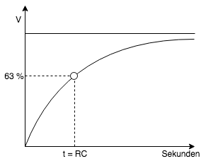

Theoretischer Aufbau
====================

Zu lösendes Problem
-------------------

Nachdem im letzten Jahr ein kleiner und größerer Wasserschaden im Keller bei uns aufkam und der große
Wasserschaden in der Ferienzeit durch Zufall bemerkt wurde, überlegte ich mir, wie ein Warnmeldesystem aussehen könnte.
Problematisch war bei dem großen Wasserschaden auch, dass dieser in der Ferienzeit auftrat und gut und gerne ein paar Tage
unbemerkt hätte bleiben können. Damit wenn nun der Keller längere Zeit nicht mehr betreten wird, ein Wasserschaden rechtzeit erkannt wird,
sollte nun ein Warnsystem installiert werden, für das ich auch die Erlaubnis der Hausverwaltung erhielt :)

Lösung
------

Grundkonzept
^^^^^^^^^^^^

Im Keller konnte eine Stromversorgung über eine Steckdose sichergestellt werden und auch das WLAN Signal aus der
Wohnetage ist im Keller noch ausreichend stark. Darum entschloss ich mich für eine einfache :term:`Raspberry Pi` Lösung,
bei der die erfassenten Sensor Daten über Telegram versendet werden sollten (:numref:`konzept_haus`).

.. _konzept_haus:

    Grundkonzept des zu lösenden Problems

Zusätzlich zur Wassermeldung sollten auch mittels eines :term:`DHT22 Temperatur- und Luftfeuchtigkeitssensor` die
Luftfeuchtigkeit und Temperatur auf Abfrage gemessen werden.

.. _aufbau_1_raspberry_pi_gpio:

Aufbau 1: Raspberry Pi GPIO
^^^^^^^^^^^^^^^^^^^^^^^^^^^

Mein erster Ansatz war es über die :term:`GPIO` Schnittstelle des :term:`Raspberry Pi`'s zu messen, ob an den Kabelenden ein Stromkreislauf
geschlossen wurde (in :numref:`konzept_raspberry_pi_version` Stromkreis schließen mittels Buttons dargestellt).
Dafür war bis auf ein altes Telefonkabel und dem :term:`Raspberry Pi` nichts weiter nötig, was den Versuch leicht
umsetztbar machte.

.. _konzept_raspberry_pi_version:

    Raspberry Pi :term:`GPIO` Lösung

Während der Umsetzung des Versuches sind mehrere Probleme aufgetreten:

1. Es war in der Software nur möglich zu messen, ob ein Stromkreislauf geschlossen wurde oder nicht, es war nicht möglich
   festzustellen, ob das Kabel an den Enden kurzgeschlossen war oder ob überhaupt ein Kabel vorhanden war.

2. Die Messung erfolgte in zu großen Abständen, somit war die Aussagekraft nicht immer zuverlässig.

3. Es gab nur eine begrenzte Anzahl an Kabeln, die am :term:`Raspberry Pi` angeschlossen werden konnten.

Der Code des Versuches kann im Branch `feature/raspberry-pi-gpio-sensor-mode`_ heruntergeladen werden.

.. _`feature/raspberry-pi-gpio-sensor-mode`: https://github.com/linuxluigi/kellerbot/tree/feature/raspberry-pi-gpio-sensor-mode

.. _aufbau_2:

Aufbau 2: Raspberry Pi und Arduino Nano
^^^^^^^^^^^^^^^^^^^^^^^^^^^^^^^^^^^^^^^

Um die in :ref:`aufbau_1_raspberry_pi_gpio` beschriebenden Probleme zu lösen, bot sich eine Lösung mit :term:`Arduino Nanos` an,
die an den Kabeln eine Kapazitätsmessung durchführen, womit sich mehrere Zustände auslesen lassen.

- kein Kabel an den Pin's angeschlossen

- Kabel ist kurzgeschlossen

- Kabel liegt im trockenen

- Kabel liegt im Wasser

In diesem Aufbau wird das Kabel fortlaufend auf diese Zustände geprüft und kann somit in Echtzeit die Daten zu
Telegram senden.

Das dritte Problem kann durch einen aktiven USB Hub gelöst werden, der am :term:`Raspberry Pi` angeschlossen wird.
An dem Hub können eine große Zahl von Arduinos ausgelesen werden.

Messung der Kapazität über ein Arduino
""""""""""""""""""""""""""""""""""""""

Bei der Kapazitätsmessung wird geprüft, wie lange die Kapazität ``C`` benötigt um 63.2% ihrer gesamten Spannung zu laden.
Dabei wird die Zeitkonstante ``TC`` über einen Widerstandskondensator ``RC`` innerhalb des Stromkreislaufs gemessen.

.. _Theorie-Kapazität:

    Kapazitätsmessung

Größere Kapazitäten benötigen länger zum Laden. Deshalb erhalten diese eine größere Zeitkonstante. Die Kapazität in einer
Widerstandskondensatorschaltung ist mit der Zeitkonstante durch folgende Formel verbunden:

.. math::

  Formel: TC = R \cdot C

- TC = Zeitkonstante in Sekunden
- R = Widerstand in Ohm
- C = Kapazität in Fahrad

Durch das Umstellung der Gleichung nach der Kapazität, ergibt sich folgende Gleichung:

.. math::

  C\ =\ \frac{TC}{R}

Nach den Messungen von http://www.circuitbasics.com/how-to-make-an-arduino-capacitance-meter/ kann der Arduino mit einer
Schaltung mit nur 2 Drähten (:numref:`Arduino_Nano_Schaltung` und :numref:`Arduino_Nano_Schaltung_Schem`) unbekannte
Kapazitäten zwischen 470 uF und 18 pF messen.

.. _Arduino_Nano_Schaltung:

    Arduino Nano Schaltung

.. _Arduino_Nano_Schaltung_Schem:
.. figure:: _static/Arduino_schem.png
    :align: center
    :scale: 35%
    :alt: :term:`Arduino Nano` Schaltung schematische Darstellung

    :term:`Arduino Nano` Schaltung schematische Darstellung

:cite:`arduino_|_44_how_2015`
:cite:`noauthor_arduino_nodate`

Problem: Internet im Keller
---------------------------

Es besteht gibt kein direkte Netzwerkverbindung von der Wohnung bis zum Keller. Der WLAN Hotspot steht im 2.OG, wodurch
bis zum Keller 3 Etage überbrück werden müssen. Um eine stabile Internetverbindung zu erhalten, gab es 2
Lösungsmöglichkeiten, bei denen keine neue Hardware nötig war:

Powerline
^^^^^^^^^

:term:`Powerline` ist ein Netzwerk über das Stromnetz, welches über mehrere Wohnungen verlegt werden kann. In meinem Test
konnte habe ich Geräte von 2 verschiedenen Anbieter ausprobieren, wobei beide die Distanz gemeistert haben. Jedoch gab es auch ein
erhöhtes Ausfallsrisiko, so dass es innerhalb einer Woche manuell neugestartet werden musste.
Dies führte zum Ausscheiden dieser Möglichkeit.

W-LAN
^^^^^

Um herauszufinden, ob dieser Lösungsansatz möglich ist, schaute ich mir mittels der Android App `Wifi Analyzer`_
die Reichweite unseres 2.4 GHz WLAN's an und stellte fest, dass im Keller ein geringes aber stabiles Signal ankam.

.. _`Wifi Analyzer`: https://play.google.com/store/apps/details?id=com.farproc.wifi.analyzer&hl=en_US

Da ich zwischenzeitlich den USB WLAN Stick für den :term:`Raspberry Pi` verloren habe, habe ich einen alten TP-LINK Router genommen
und dort ein neues Betriebsystem openWrt_ aufgespielt. Somit konnte der WLAN Router nicht nur als :term:`Access Point` dienen,
sondern sich auch in ein anderes WLAN-Netzwerk einwählen und den Datenverkehr über Ethernet routen.
Er konnte also als :term:`WLAN zu LAN Bridge` arbeiten (:numref:`haus_wlan_repeater`).

.. _openWrt: https://openwrt.org/

.. _haus_wlan_repeater:

    :term:`WLAN zu LAN Bridge` setup - Theorie

Dieses Setup sorgt nun auch dafür, dass sich bei Abbruch der WLAN Verbindung (z.B. durch einen Router Neustart des :term:`Access Point`)
der Brige Router von alleine wieder neu verbindet. Ein weiterer Vorteil dieser Methode gegenüber
eines durchschinttlichen WLAN Sticks liegt in den Antennen des TP-Link Routers, welche sehr leistungsstark sind und sich
gut in die Richtung des Signals ausrichten lassen (:numref:`haus_wlan_repeater_foto`).

.. _haus_wlan_repeater_foto:

    WLAN zu LAN Bridge setup - Praxis